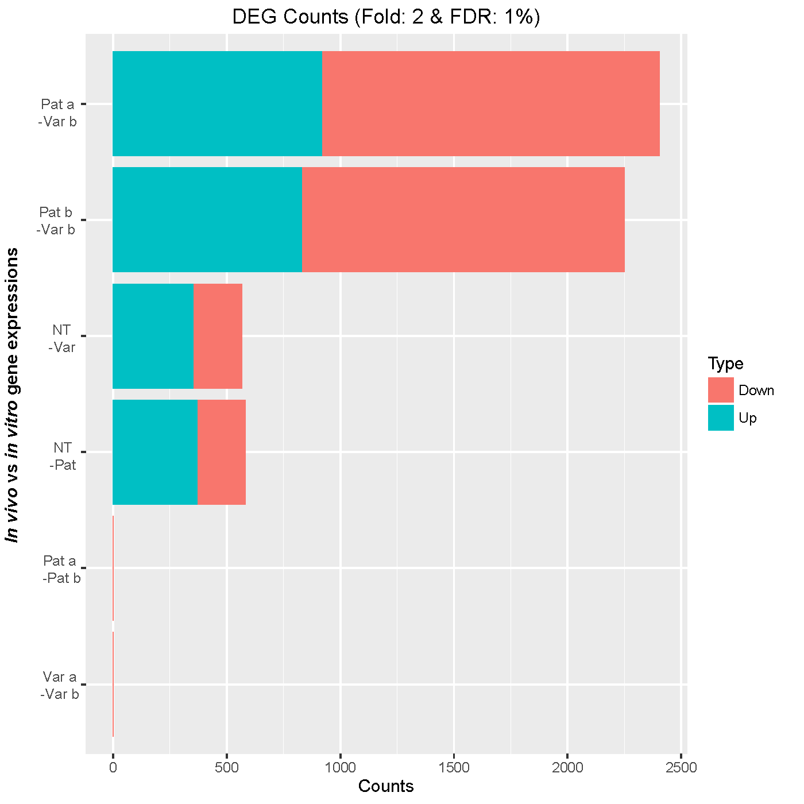
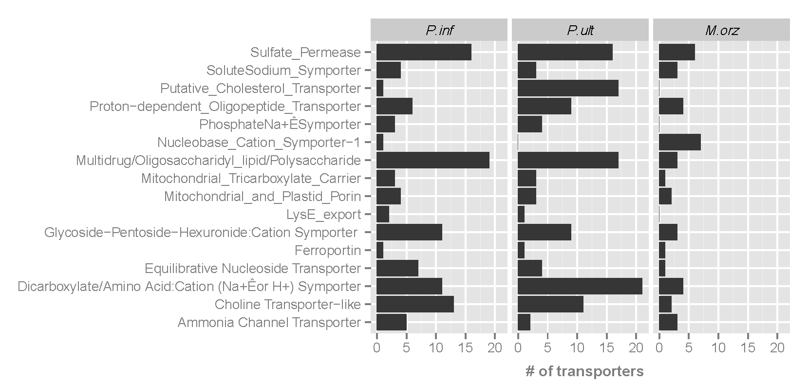

## Data science portfolio

This portfolio includes several projects including data analyses and visualizations for omics and big data. Each section/category focuses on a distinct project.

## Table of contents
* [General info](#general-info)
* [Big Data](#image)
* [Project A](#project)
* [Project B](#project)
* [Project C](#project)
* [Contact](#contact)

## General info
You have collected data and it is the BIG DATA that you have now! Congratulation? But, what is the next step? Or what is your next question? To address your next move you need to  discover hidden paterns, corelations, and come to the point that you can visualize your data depiting the new opportunities for the future step(s) and accomplishments.

## Big Data

## Project A
[Pathogen control: README](./ProjectA/README_ProjectA.md) 
##### The in vivo upregulated nutrient transports of the pathogen may be involved in the virulence of the pathogen.

#### Differential gene expression analysis (systemPipeR -  edgeR)
Pathogen grown in host downregulate/upregulate larger number of nutrient transporter genes (more than 2 fold, FDR 1%) at early stage of host-pathogen interaction time point compared to late stage infection time point. 

#### The nutrient transporters have distinct gene expression profiles
The image depicts the gene expression for the memebers of nutrient transporter families from in vivo and n vitro grown conditions.

#### Difference in the type and number of nutrient transporters in different species
The three microorganisms depicted in the image have different nutritinals needs hence show differences in the presence and/or abscence of a family of nutrient transporters or the memebers.

## Project B

## Project  

## Contact
mabraham@yahoo.com

