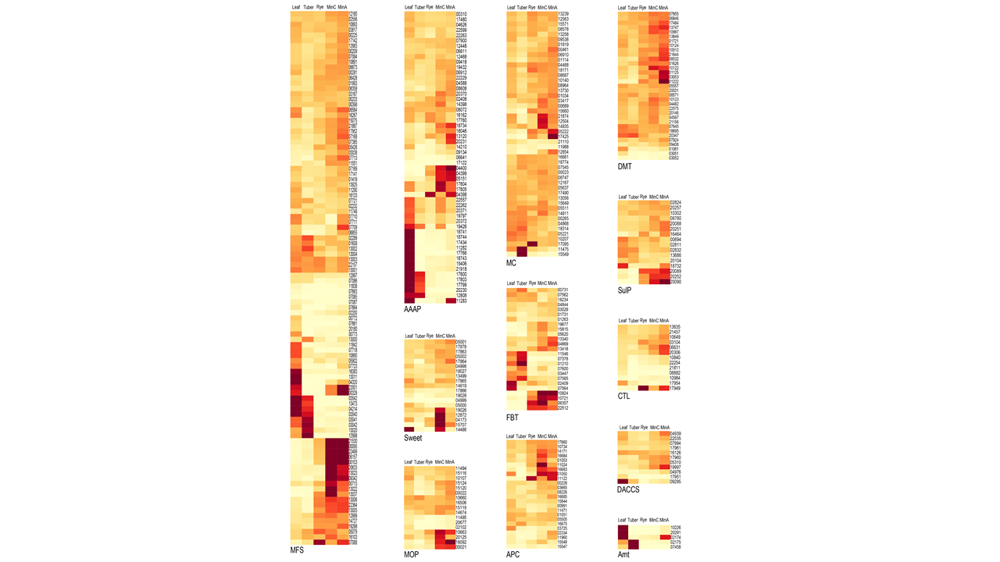

## Data science portfolio

This portfolio includes several projects including data analyses and visualizations for omics and big data. Each section/category focuses on a distinct project.

## Table of contents
* [General info](#general-info)
* [Big Data](#image)
* [Project A](#project)
* [Project B](#project)
* [Project C](#project)
* [Contact](#contact)

## General info
You have collected data and it is the BIG DATA that you have now! Congratulation? But, what is the next step? Or what is your next question? To address your next move you need to  discover hidden paterns, corelations, and come to the point that you can visualize your data depiting the new opportunities for the future step(s) and accomplishments.

## Big Data

## Project A
[Pathogen control: README](./ProjectA/README_ProjectA.md) 
### The in vivo upregulated nutrient transports of the pathogen may be involved in the virulence of the pathogen.
#### Image includes all the idnetified nutrinet trnasporter families in this study depicting the gene expression of memebers of families in both in vivo and n vitro conditions.

## Project B

## Project  

## Contact
mabraham@yahoo.com

